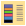
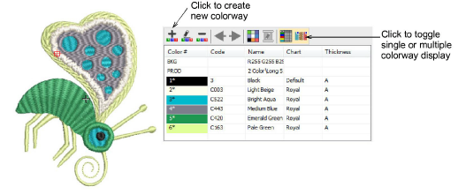
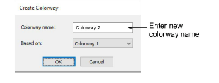
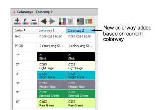
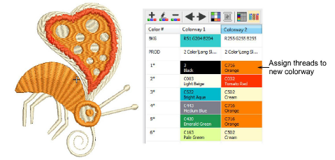

# Add colorways

|  | Use Color > Colorway Editor to add or edit colorways.                      |
| ------------------------------------------------ | -------------------------------------------------------------------------- |
|  | Use Colorway Editor > Create Colorway to add a new colorway to the design. |

When you create a new design, it contains a single default [colorway](../../glossary/glossary) called ‘Colorway 1’. You can add a virtually unlimited number of colorways to the design using the same or different thread sets. Preview designs in different colors on different fabrics. Colorways are saved with the design in [EMB](../../glossary/glossary) format. They can also be saved to an EMT template file for use in future designs. They cannot, however, be saved with machine files.

::: tip
Other settings are included as part of the colorway definition – [background](../../glossary/glossary#background) color, fabric, or product, as well as display colors for borer symbols, unsewn stitches, selected objects, object outlines and the grid.
:::

## To add a colorway...

- Open the design and click the Colorway Editor icon.

- Click the Create Colorway icon.

- Enter a new colorway name – e.g. ‘Colorway 2’. The new colorway will use the current colorway as a starting point.

- Assign colors from available threads to selected color slots.

::: info Note
As dark-colored threads cover light-colored fabrics better than vice versa, different densities may be required when changing from one colorway to another. Colorways do not automatically compensate for different densities. These must be adjusted manually.
:::

- Use the internal toolbar to edit:

|      | Give the colorway a unique name for easy identification in the droplist and production worksheet – e.g. a name which reflects the background fabric. |
| ---------------------------------------------------- | ---------------------------------------------------------------------------------------------------------------------------------------------------- |
|      | Remove a colorway from the design.                                                                                                                   |
|  | Change the colorway background fabric and/or color.                                                                                                  |

::: tip
If you change the [background](../../glossary/glossary#background) in Colorway 1 and save it to your template, it will display like this at start up.
:::

::: tip
You can also match thread colors from imported graphics – [vector](../../glossary/glossary) or [bitmap](../../glossary/glossary#bitmap).
:::

## Related topics...

- [Viewing colorways](../../Basics/view/Viewing_colorways)
- [Assign thread colors](../../Basics/threads/Assign_thread_colors)
- [Add & match image colors](../../Automatic/bitmaps/Add_match_image_colors)
- [Set fabric backgrounds](Set_fabric_backgrounds)
- [Printing design reports](../../Production/reports/Printing_design_reports)
- [Working with templates](../properties/Working_with_templates)
