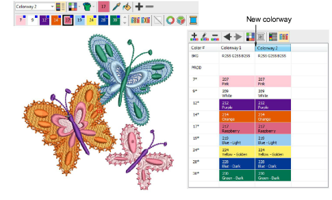
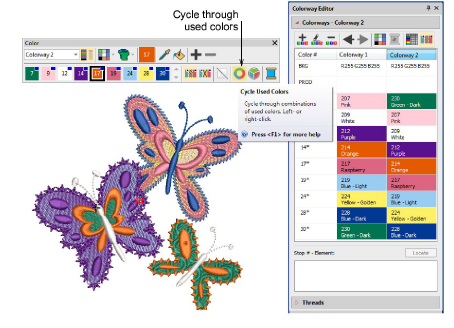
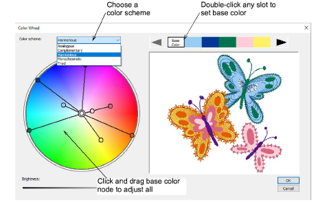
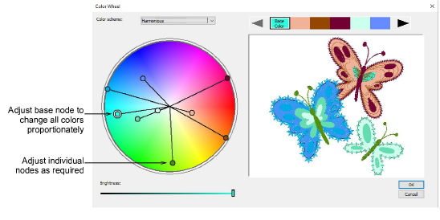
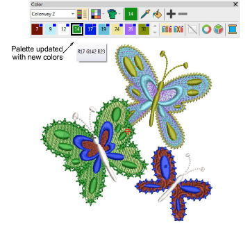

# Change color schemes

|  | Use Color > Cycle Used Colors to cycle through combinations of used colors. Right- or left-click. |
| -------------------------------------------------- | ------------------------------------------------------------------------------------------------- |
|            | Use Color > Color Wheel to access Color Wheel to test combinations of related colors.             |

The color tools allow you to quickly re-color entire designs. Their main purpose is to create new ‘[colorways](../../glossary/glossary)’ quickly and easily in order to ‘spice up’ old designs or place them on a different fabric.

## To change color schemes...

- Optionally, add a new colorway for your new color scheme. [See Add colorways for details.](Add_colorways)

- Use the Cycle Used Colors tool to try out different combinations using threads already in the design.

- Alternatively, select Color Wheel. This allows you to cycle through many color combinations using preset color schemes including Analogous, Complementary, Harmonious, etc.

- Click and drag the ‘base color’ node to test combinations against different background colors. You can make any color the base color by double-clicking in the palette at the top of the dialog.
- Each color node can be further individually adjusted.

- To adjust the brightness of the entire design, select the base color node and adjust the Brightness control.
- Click OK to apply changes. New colors are added to the palette as RGB values.

- Match and assign thread colors manually or use the Match All function.

## Related topics...

- [Assign thread colors](../../Basics/threads/Assign_thread_colors)
