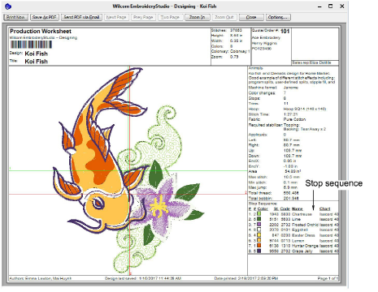

# Color blocks & stop sequence

A color block corresponds to a color change in the design. It may be comprised of one or more same-color objects. These may form a single group – e.g. ‘ropes’ – or more – e.g. ‘ropes and birds’. Each color block, or ‘element’, can be given a descriptive name for easy identification. These can be included on the [production worksheet](../../glossary/glossary#production-worksheet). Together this information is known as the ‘stop sequence’. The operator generally uses it to ensure that correct colors are used in the correct sequence during production.

::: info Note
The Color-Object List shows the same sequential list of objects, grouped by ‘color block’.
:::

## Related topics...

- [Design thread colors](Design_thread_colors)
- [Name design elements](Name_design_elements)
- [Split color blocks](Split_color_blocks)
