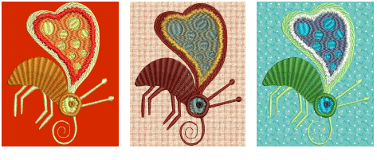

# Colorways

When digitizing, you select colors from a [color palette](../../glossary/glossary). These can be tailored to each design or color scheme. The particular ‘[colorway](../../glossary/glossary)’ represents the actual thread colors in which a design will be stitched. EmbroideryStudio lets you define multiple color schemes and switch between them.

For each colorway you define, you can select colors from commercial thread charts or define your own. Search for particular threads by specific code. Locate thread colors based on closest match across one or several thread charts.

EmbroideryStudio also lets you set the background color, fabric, or product of the current colorway for more realistic previews and presentations. The background and product are saved with the colorway.

Note: You can also print multiple colorways, design [background](../../glossary/glossary) and product, and icons of [color blocks](../../glossary/glossary) in the [production worksheet](../../glossary/glossary). [See also Printing design reports.](../../Production/reports/Printing_design_reports)

## Related topics...

- [Creating colorways](Creating_colorways)
- [Color blocks & stop sequence](Color_blocks_stop_sequence)
- [Fabric & product backgrounds](Fabric_product_backgrounds)
