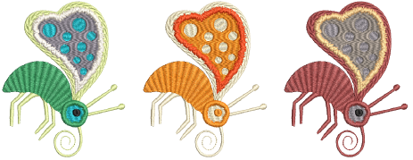

# Creating colorways

EmbroideryStudio provides various techniques for selecting and changing colorways manually or generating them automatically.

::: warning Caution
Due to differences in computer monitors and video cards, onscreen colors should only be used as guides. Always check thread colors against the actual thread chart you intend to use.
:::

## Related topics...

- [Add colorways](Add_colorways)
- [Change color schemes](Change_color_schemes)
