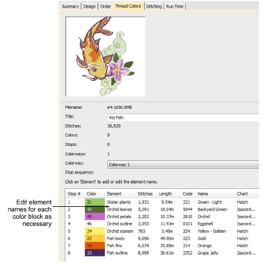

# Design thread colors

|  | Use Docker > Design Information to view and modify design details prior to design approval or stitchout. |
| ---------------------------------------------------- | -------------------------------------------------------------------------------------------------------- |

The Thread Colors tab displays the color sequence and stitch counts for each design ‘element’. Elements equate to color changes. The tab also provides thread usage estimates which may be used for costings as well as production requirements.

Data is extracted from the design file and, apart from the Element column, cannot be modified.

| Field            | Function                                                                                                                                  |
| ---------------- | ----------------------------------------------------------------------------------------------------------------------------------------- |
| Filename         | File name of the selected design. This will often be a number or alphanumeric format for easy cataloging.                                 |
| Title            | Defaults to filename. Add a more descriptive name for easy searching. This name appears on the approval sheet or worksheet.               |
| Stitches         | Indicates total stitch count for design.                                                                                                  |
| Colors           | Indicates number of thread colors involved in the design.                                                                                 |
| Colorways        | Number of colorways in the design.                                                                                                        |
| Current colorway | Use the droplist to change colorways, if available. When choosing a different colorway, the thumbnail and stop sequence list are updated. |

The table at the bottom lists all color changes in the design as they will appear on the production worksheet. It provides the following details:

| Field     | Function                                                                                                                                                              |
| --------- | --------------------------------------------------------------------------------------------------------------------------------------------------------------------- |
| Stop #    | The machine stop corresponding to the color change.                                                                                                                   |
| Color     | Indicates color slot number of the color in color palette.                                                                                                            |
| Element   | User-defined name to identify each color block.                                                                                                                       |
| Stitches  | There is a stitch count for each element in the design. You can show this as a discrete stitch count or a cumulative stitch count.                                    |
| Length    | Meterage of thread required per color.                                                                                                                                |
| Code      | Color code as registered in the thread chart.                                                                                                                         |
| Name      | Color name appearing in thread chart.                                                                                                                                 |
| Chart     | Brand name of thread chart used.                                                                                                                                      |
| Thickness | A: Normal embroidery thread (approx. denier 40) B: Thicker than normal (approx. denier 30) C: Finer than normal (approx. denier 80) D: Very fine (approx. denier 100) |

## Related topics...

- [Name design elements](Name_design_elements)
- [Assign thread colors](../../Basics/threads/Assign_thread_colors)
- [Thread usage estimates](../../Basics/threads/Thread_usage_estimates)
- [Modify thread details](../../Basics/threads/Modify_thread_details)
- [Other general options](../../Setup/settings/Other_general_options)
