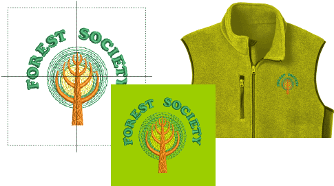

# Fabric & product backgrounds

EmbroideryStudio lets you set background color, fabric, or product backdrop for more realistic previews and presentations. The background is saved with the colorway.

::: tip
While you can change background colors, fabrics, and even products, this does not automatically affect current [fabric](../../glossary/glossary) settings. [See Working with fabrics for details.](../properties/Working_with_fabrics)
:::

## Related topics...

- [Set fabric backgrounds](Set_fabric_backgrounds)
- [Visualize products](Visualize_products)
