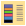
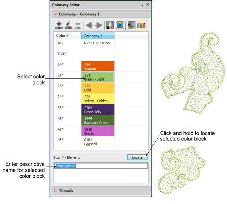
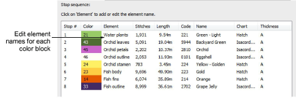

# Name design elements

|      | Use Docker > Colorway Editor to add or edit colorways.                                                   |
| -------------------------------------------------------------- | -------------------------------------------------------------------------------------------------------- |
|  | Use Docker > Design Information to view and modify design details prior to design approval or stitchout. |

You can view [color blocks](../../glossary/glossary) in the Colorway Editor. Named color blocks are known as design ‘elements’. This information is saved with the design and printed on production worksheets as an aid for machine operators.

## To name design elements...

- Click the Colorway Editor icon to access the Colorway Editor.

- Select a color and click and hold Locate to view in isolation. Elements corresponding to the color are listed below. If there is more than one, select and click Locate.
- Double-click the Element field and enter a descriptive name – e.g. ‘Stems’.
- To check design elements, select Design > Design Information > Thread Colors.

- In the Element fields, edit names for each color block as desired. This information can be included on the production worksheet.

## Related topics...

- [Assign thread colors](../../Basics/threads/Assign_thread_colors)
- [View selected color blocks](../../Basics/view/View_selected_color_blocks)
- [Printing design reports](../../Production/reports/Printing_design_reports)
- [Customizing design reports](../../Production/reports/Customizing_design_reports)
