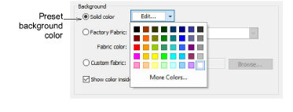
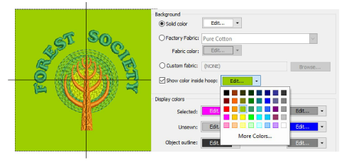
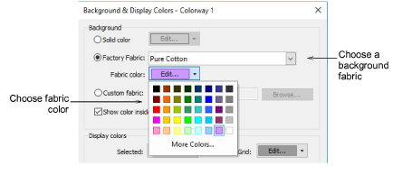
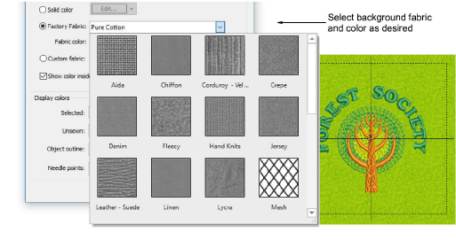
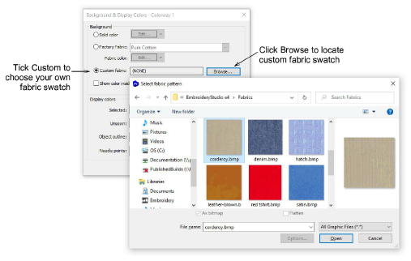

# Set fabric backgrounds

|  | Use Color > Background & Display Colors (or Colorway Editor docker) to change design background presets for the current colorway. |
| ------------------------------------------------------------------ | --------------------------------------------------------------------------------------------------------------------------------- |

EmbroideryStudio lets you set the colorway background for more realistic previews and presentations. These can be included on approval or production sheets. Choose from an assortment of swatches, or if you have your own, import them into your design. Almost any artwork can be used – photos, magazine pictures, clipart images, and even fabric samples. The background is saved with the colorway.

## To set the background...

- Open the design and select a colorway.

- Click Background & Display Colors icon.

- To set a background color, select from the palette in the droplist.
- You can, if you prefer, color only the background inside the hoop, leaving the rest of the design window a neutral color.

- To set a background fabric, select Factory Fabric.

- Click the Fabric droplist for more options.

- Alternatively, to choose a custom swatch, select Custom Fabric and click Browse.

- Click OK.

::: info Note
If you change the background in Colorway 1 and save your template, it will always display like this at start up.
:::

## Related topics...

- [Add colorways](Add_colorways)
- [Working with fabrics](../properties/Working_with_fabrics)
- [Visualize products](Visualize_products)
