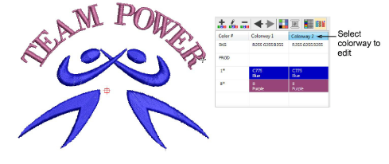
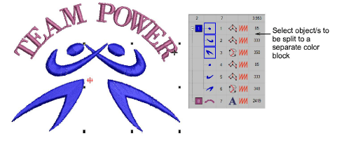
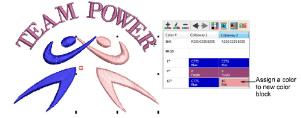
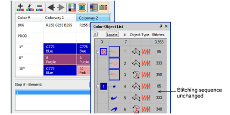

# Split color blocks

|  | Use Color > Colorway Editor to assign thread colors to slots in the color palette.                                  |
| ---------------------------------------------------------- | ------------------------------------------------------------------------------------------------------------------- |
|      | Use Color > Split Palette Color to create a new color slot with the same thread specification as the selected slot. |

A [color block](../../glossary/glossary) corresponds to a color [stop](../../glossary/glossary) in the design. It may comprise a single object or group of like-color objects – e.g. ‘ropes and birds’. In one [colorway](../../glossary/glossary) you may want to assign the same thread to all items in the color block, while in another you may want to assign different colors. The Split Palette Color tool makes this possible.

## To split a color block...

1Open the design and select a colorway.

2Open the Colorway Editor.

3Create a new colorway or select one to edit.

4Select the object/s you want to split. The Split Palette Color button is activated.

5Click the Split Palette Color icon. A new color slot of the same color is added to the color palette. Selected objects are assigned to the new palette position.

6Assign a new color to the slot. The colors of other colorways remain unaffected. By default, the new color slot is placed at the end of the palette. This, however, does not affect the stitching sequence.

## Related topics...

- [Assign thread colors](../../Basics/threads/Assign_thread_colors)
