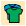
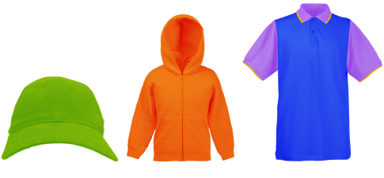
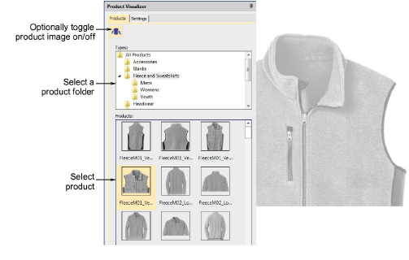
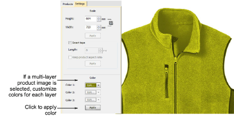
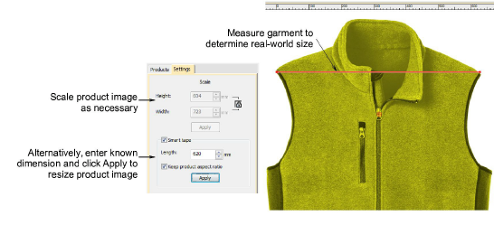
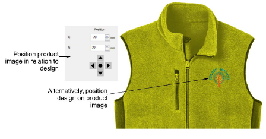
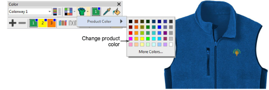

# Visualize products

|  | Use Color > Product Visualizer to choose a garment or product backdrop on which to position your decoration. |
| ------------------------------------------------------ | ------------------------------------------------------------------------------------------------------------ |
|              | Click View > Show Product to toggle current product display. Right-click for Product Visualizer settings.    |
|          | Use Zoom > Zoom to Product to view the entire product in the design window.                                  |

EmbroideryStudio allows you to choose a garment or product backdrop on which to position decorations. This feature is mainly used to display location, size and overall appearance for visualization and customer approval purposes. Production worksheets provide an option to print approval sheets with or without garment backdrops.

Choose colors for each product type. The software provides a library of garments of common brands and styles. Up to three layers of color are supported for multi-color garments.

## To visualize a product...

- Open the design and select a colorway.

- Click the Product Visualizer icon. The docker appears.

- Select a category and click a garment or product to select. The product image is centered in the design window at the default scale.
- Optionally, a Custom option allows you to import custom product images. These need to be prepared as grayscale images. They need to be correctly sized.
- Switch to the Settings tab. This lets you color, size, and position the product in the design window.

- Scale the product image as necessary. Scale should be adjusted according to actual garment size – XS, S, M, L, XL, or XXL.
- Optionally, use the Smart Tape function to measure, say, shoulder size against the ruler. Adjust the Length field and press Apply to resize the product image accordingly. Use the Keep proportions setting as appropriate.

- Finally, position the design on the product image. Press Ctrl+A to select and drag or use arrow keys to nudge.

- Alternatively, position the product image in relation to the design. By default, the center is placed at the design origin. The ‘X’ and ‘Y’ fields display 0,0.
- Enter values directly into the ‘X’ and ‘Y’ fields to move the image center to the new location.
- Use the nudge control buttons to move the image incrementally.
- To toggle the product background on/off, click the Show Product icon.
- To change colors ‘on-the-fly’, use the Product Visualizer droplist and change fabric colors via the Product Color popout menu.

## Related topics...

- [Printing design reports](../../Production/reports/Printing_design_reports)
- [Product Visualizer Templates](../../Management/product_templates/Product_Visualizer_Templates)
