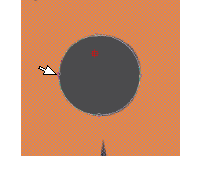
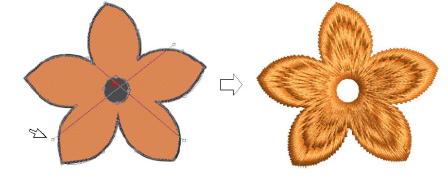

# Add holes to free-form shapes

|  | Use Traditional Digitizing > Complex Fill to digitize filled shapes with a single stitch angle. Right-click for settings.    |
| ---------------------------------------------------- | ---------------------------------------------------------------------------------------------------------------------------- |
|    | Use Traditional Digitizing > Complex Turning to digitize filled shapes with turning stitch angles. Right-click for settings. |

While EmbroideryStudio provides dedicated tools for cutting and filling holes in existing objects, it also lets you add holes to closed shapes as you digitize.

## To add holes to free-form shapes...

- Use one of the free-form digitizing tools to create your shape. Simply follow the prompts to add holes as you digitize. Alternatively, select the final object and click the associated free-shape tool. Points display around the object outline.
- Digitize additional holes making sure they do not overlap. Press Enter each time.

- If you make a mistake, press Backspace to delete the last point. Press Esc to undo all new points.

- When you have digitized all additional holes, press Enter again.

Tip: To remove unwanted holes, select the object and use the Reshape Object tool to delete control points around the hole.

## Related topics...

- [Adding & filling holes](../../Modifying/productivity/Adding_filling_holes)
- [Reshaping embroidery objects](../../Modifying/reshape/Reshaping_embroidery_objects)
- [Removing underlying stitching](../../Quality/quality/Removing_underlying_stitching)
