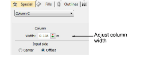
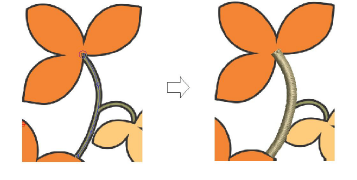
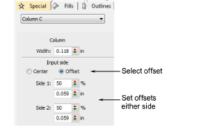
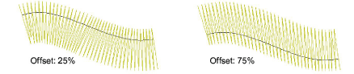

# Adjust column width & offset

|  | Use Traditional Digitizing > Column C to digitize columns or borders of fixed width. Right-click for settings. |
| ------------------------------------------ | -------------------------------------------------------------------------------------------------------------- |

By default, stitches are positioned around the center of an [Column C](../../glossary/glossary) object. Set an exact offset via Object Properties. You can also set an exact width.

## To adjust column width and offset...

- Double-click an [Column C](../../glossary/glossary) object or right-click the tool to access object properties.

- Enter a column Width.

- In the Input Side panel, select Offset.

- Set an offset in either Side 1 or Side 2 field.

Tip: You can also change the width of Column C objects by adjusting control points with the Reshape tool.

## Related topics...

- [Ruler & guide display options](../../Setup/settings/Ruler_guide_display_options)
- [Reshaping embroidery objects](../../Modifying/reshape/Reshaping_embroidery_objects)
