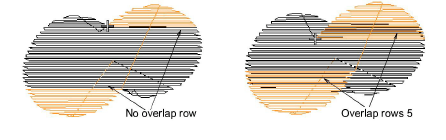

# Adjust segment overlaps

|  | Use Traditional Digitizing > Complex Fill to digitize filled shapes with a single stitch angle. Right-click for settings.    |
| ---------------------------------------------------- | ---------------------------------------------------------------------------------------------------------------------------- |
|    | Use Traditional Digitizing > Complex Turning to digitize filled shapes with turning stitch angles. Right-click for settings. |

Free shapes generally stitch out in several segments, joined by travel runs. Where [segments](../../glossary/glossary#segments) within an object meet, the [push-pull](../../glossary/glossary#push-pull) effect on the fabric during stitching may cause gaps to appear. These gaps can be prevented by adding overlapping rows.

## To adjust segment overlaps...

- Double-click a free-shape object to access object properties.

- Adjust the number of overlapping rows where [segments](../../glossary/glossary#segments) join. An overlap of ‘1 row’ means no overlap between segments. An overlap of ‘2 rows’ means that the segment is extended by one extra row of stitches.

- With Complex Turning objects, you can also adjust the taper angle. This value limits the width of overlaps. It defaults to 22.5° with a range of 15° to 90°.

