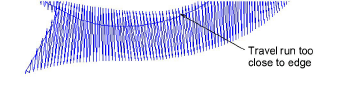
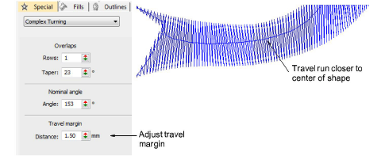

# Adjust travel margins

|  | Use Traditional Digitizing > Complex Turning to digitize filled shapes with turning stitch angles. Right-click for settings. |
| -------------------------------------------------- | ---------------------------------------------------------------------------------------------------------------------------- |

When dealing with complex shapes with multiple segments, you may want to keep travel runs away from the boundary for various reasons. If, for instance, you are using Jagged Edge effect, the travel might become visible through shortened stitches. For this reason, you can specify a margin.

## To adjust travel margins...

- Select an object.

- Right-click the Complex Turning icon to access object properties.

- Adjust the travel margin in the Distance field.
