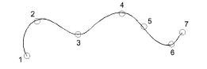
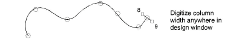
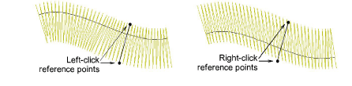

# Create columns & borders

|  | Use Traditional Digitizing > Column C to digitize columns or borders of fixed width. Right-click for settings. |
| -------------------------------- | -------------------------------------------------------------------------------------------------------------- |

Digitize columns and borders of fixed width with the Column C tool.

## To create columns and borders...

1Insert some artwork to use as a digitizing backdrop.

2Select a color and stitch type – e.g. Satin.

3Select Column C and mark corner or curve points around the outline of the shape.

- Click to enter corner points.
- Right-click to enter curve points.

Tip: The Show Column C width guide setting in the Options dialog activates a special cursor. This is useful when digitizing a border based on a background image.

4To close the shape, enter the last point on top of the first.

5Press Enter.

6Specify column width:

- To use the default width – as set in the Object Properties > Special > Column C docker – press Enter.
- To specify a width, mark two additional points. By default, stitches are positioned around the center of the digitized line.

- To specify an offset, right-click reference points instead of left-clicking.

7Press Enter to finish.

## Related topics...

- [Stitch Types](../stitches/Stitch_Types)
- [Ruler & guide display options](../../Setup/settings/Ruler_guide_display_options)
- [Reshape Column C objects](../../Modifying/reshape/Reshape_Column_C_objects)
