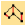
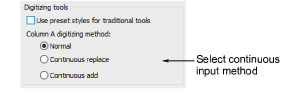
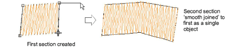
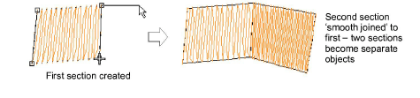

# Create smooth joins

|  | Use Traditional Digitizing > Column A together with ‘continuous input’ to create single objects comprising separately stitched sections. |
| ------------------------------------------ | ---------------------------------------------------------------------------------------------------------------------------------------- |
|          | Use Standard > Options to access application options for design view, grid & guides, and other settings.                                 |

The ‘continuous input’ option provides a simple and efficient way of digitizing a single [Column A](../../glossary/glossary) object comprised of separately stitched sections. The objects so created can be deleted or edited using standard reshape tools.

## To create smooth joins...

1Click the Options icon or select Setup > Options and click the General tab.

2Select a continuous input method:

- Normal: Use this for non-continuous input.
- Continuous replace: Use this to continue digitizing the same object after each Enter keypress. Any [properties](../../glossary/glossary) you change during digitizing will affect the entire object, not just the section you are working on.

- Continuous add: Use this to join objects of different size where different stitch types are used – e.g. a narrow section of satin stitch joining to a larger section of tatami.

3Click OK.

4Digitize the Column A object. When you press Enter, the digitized object fills with stitches. The input tool is still active.

5If you are using Continuous Add mode, you can select another stitch type at this point.

Tip: To stop the screen scrolling while moving the mouse, hold down Shift and click the stitch type button you require.

6Recommence digitizing where you left off and press Enter when you have finished.

If you are using Continuous Add mode, the new section is a new object. This means that, while the two sections are smoothly joined, they can have different properties, including stitch type.

Tip: To start a new object without joining to the previous object, click the Column A icon again.

## Related topics...

- [Digitize columns of varying width](Digitize_columns_of_varying_width)
