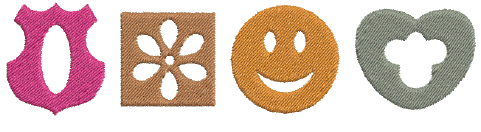
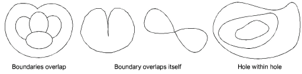

# Creating free-form shapes

In EmbroideryStudio, you digitize free shapes with turning stitches with the all-purpose Complex Turning tool. Use the Complex Fill tool for free shapes with fixed stitch angles. By digitizing further internal boundaries, you can create shapes with holes in them.

Boundaries in complex shapes should not overlap or intersect. The shapes below, for example, cannot be successfully digitized.

::: tip
You can create new objects from existing boundaries using the Fill Holes feature. Alternatively, you can use other objects to cut holes. See [Removing underlying stitching](../../Quality/quality/Removing_underlying_stitching) and [Fill holes](../../Modifying/productivity/Fill_holes) for details.
:::

## Related topics...

- [Digitize free-form shapes](Digitize_free-form_shapes)
- [Add holes to free-form shapes](Add_holes_to_free-form_shapes)
- [Set nominal angles](Set_nominal_angles)
- [Adjust segment overlaps](Adjust_segment_overlaps)
- [Adjust travel margins](Adjust_travel_margins)
