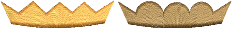
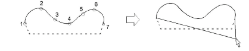
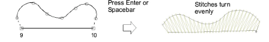
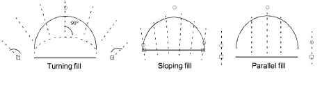

# Digitize columns of turning stitches

|  | Use Traditional Digitizing > Column B to create asymmetrical columns of turning stitches, where opposite sides are different shapes. Right-click for settings. |
| -------------------------------- | -------------------------------------------------------------------------------------------------------------------------------------------------------------- |

Use the Column B tool to digitize shapes where one side is different to the other, especially where one side requires more points than the other. Stitches turn evenly throughout the entire shape.

## To digitize asymmetric columns...

1. Click the Column B icon.

2. Select a color and stitch type – e.g. Satin.

3. Digitize the first side of the shape – i.e. top or left – by marking points.

- Click to enter corner points.
- Right-click to enter curve points.

Tip: If you make a mistake, press Backspace to delete the last point. Press Esc to undo all new points. Press Esc again to exit digitizing mode.

4. Press Enter.

An elastic line attaches to the pointer, ready for you to digitize the second side of the shape.

5. Digitize the second – i.e. bottom or right – side of the object.

Tip: Stitch angles vary from tightly turning fills to parallel fills, depending on the ends of the shape – the more ‘pointy’, the tighter the stitch angles.

6. When you have finished digitizing the shape, either:

- Press Enter to keep the last stitch and place the [exit point](../../glossary/glossary) at the last point you digitized, or
- Press Spacebar to omit the last stitch and place the exit point on the opposite side of the column.

## Related topics...

- [Stitch Types](../stitches/Stitch_Types)
