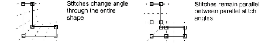

# Digitize columns of varying width

|                  | Use Traditional Digitizing > Column A to create columns of varying width and stitch angle. Right-click for settings.     |
| ------------------------------------------------ | ------------------------------------------------------------------------------------------------------------------------ |
|  | Use Graphics Digitizing > Digitize Column to create columns of varying width and stitch angle. Right-click for settings. |

Use the Column A or Digitize Column tools to digitize columns of varying width and [stitch angle](../../glossary/glossary).

## To digitize columns of varying width...

1Click the Column A or Digitize Column icon.

2Select a color and stitch type – e.g. Satin.

3Digitize the column by marking points on alternate sides of the column.

- Click to enter corner points.
- Right-click to enter curve points.

The control points in a pair do not have to be the same type. For example, one can be a corner point, the other a curve.

Tip: If you make a mistake, press Backspace to delete the last point. Press Esc to undo all new points. Press Esc again to exit digitizing mode.

4When you have finished digitizing, either:

- Press Enter to keep the last stitch and place the [exit point](../../glossary/glossary) at the last point you digitized, or
- Press Spacebar to omit the last stitch and place the exit point on the opposite side of the column.

## Related topics...

- [Stitch Types](../stitches/Stitch_Types)
