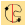
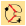
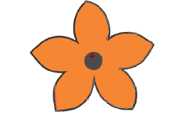
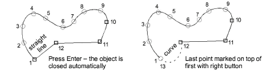
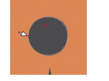
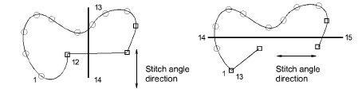
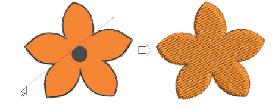
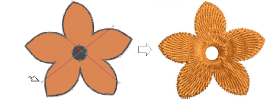
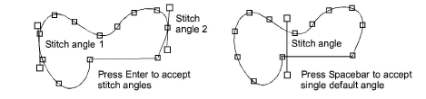

# Digitize free-form shapes

|  | Use Traditional Digitizing > Complex Fill to digitize filled shapes with a single stitch angle. Right-click for settings.    |
| ------------------------------------------ | ---------------------------------------------------------------------------------------------------------------------------- |
|    | Use Traditional Digitizing > Complex Turning to digitize filled shapes with turning stitch angles. Right-click for settings. |

Digitize free-form shapes with Complex Fill or with Complex Turning. The method is essentially the same:

- Digitize the shape
- Define entry and exit points
- Define stitch angle/s. Complex Turning lets you create multiple stitch angles.

## To digitize a free-form shape...

1Insert artwork to use as a digitizing backdrop. Make sure Show Bitmaps or Show Vectors are toggled on or press 0 (zero) to see artwork on screen.

2Select a color and stitch type.

3Select a tool and mark corner or curve points around the outline of the shape.

- Click to enter corner points.
- Right-click to enter curve points.

Tip: If you make a mistake, press Backspace to delete the last point. Press Esc to undo all new points. Press Esc again to exit digitizing mode.

4Close the shape:

- To close with the same type of point as the last entered – i.e. corner or curve – press Enter.
- To close using a different type of point, mark the last on top of the first and press Enter.

5Optionally, digitize additional (internal) boundaries in the same way and press Enter.

6Define entry and exit points by marking two points outside the object boundary and press Enter. The Closest Join method (the default) automatically calculates closest join between objects while digitizing. When deactivated, entry and exit points need to be set manually.

Tip: If you choose to digitize entry/exit points manually, place them opposite each other on the boundary in order to minimize travel stitching. Then define the stitch angle to be perpendicular to the line between entry and exit points.

7Mark stitch angles:

- If you are using Complex Fill, mark two points.

- If you are using Complex Turning, add more stitch angles as desired. Stitch angles may intersect over any holes you have digitized.

- Alternatively, press Enter to accept calculated stitch angles. Or press Spacebar to discard calculated stitch angles and accept a single default stitch angle.

Tip: You can adjust and/or add [stitch angles](../../glossary/glossary) using the Reshape Object tool.

8Press Enter. Free shapes generally stitch out in several segments, joined by travel runs. However, all segments and boundaries are part of the same object.

Tip: To view stitches better, toggle off Show Bitmaps (press D).

## Related topics...

- [View graphical components](../../Basics/view/View_graphical_components)
- [Stitch Types](../stitches/Stitch_Types)
- [Choosing threads](../../Basics/threads/Choosing_threads)
- [Add holes to free-form shapes](Add_holes_to_free-form_shapes)
- [Other general options](../../Setup/settings/Other_general_options)
- [Adjusting stitch angles](../../Quality/quality/Adjusting_stitch_angles)
- [Stabilizing with automatic underlay](../../Quality/underlays/Stabilizing_with_automatic_underlay)
