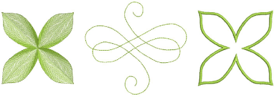
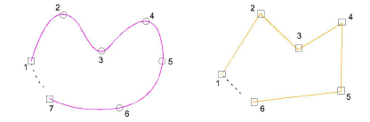
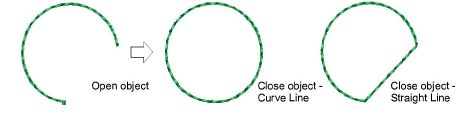

# Digitize open & closed shapes

|      | Use Graphics Digitizing > Digitize Open Shape to digitize open shapes. Press &lt;Ctrl&gt; to constrain.           |
| -------------------------------------------- | ----------------------------------------------------------------------------------------------------------- |
|  | Use Graphics Digitizing > Digitize Closed Shape to digitize closed shapes. Press &lt;Ctrl&gt; to create a square. |

Use the Digitize Open Shape tool to digitize open shapes with any kind of outline stitch. Digitize Open Shape places a row of stitches along a digitized line. This tool is typically used to add borders or details to designs. Digitize free-form closed shapes with the Digitize Closed Shape tool. This tool can be used with either outline or fill stitch types.

Tip: To create both an outline and a fill, create the fill first, then select and duplicate the object and convert the duplicate to an outline, which is stitched after the fill.

## To digitize an open or closed shape...

- Select a tool – open or closed shape – together with a suitable stitch type – outline for open, outline or fill for closed.
- Choose a color from the Color toolbar. The palette contains a selection of colors which can be tailored to each design or color scheme.
- Digitize the shape by marking reference points:
- Click to enter corner points.
- Right-click to enter curve points.

Tip: Follow the prompts in the Prompt Bar to help you digitize. If you make a mistake, press Backspace to delete the last reference point, then continue adding reference points or press Esc to delete all the points so you can start again.

- Press Enter to complete a shape. With the Digitize Closed Shape tool, the shape will be closed with the same type of reference point as the last you digitized – i.e. corner or curve. To close with a different type of reference point, mark the last on top of the first and press Enter.
- If you decide to close an open object, use Edit > Close Curve... commands to close using straight or curved points.

- Press Esc to deselect the tool.

Note: By default, objects are joined by the Closest Join method. If deactivated, all newly digitized objects are joined by the As Digitized method. This means you need to specify entry and exit points, following prompts in the Prompt Bar.

## Related topics...

- [Choosing threads](../../Basics/threads/Choosing_threads)
- [Other general options](../../Setup/settings/Other_general_options)
- [Selecting & editing stitches](../../Modifying/functions/Selecting_editing_stitches)
- [Minimizing connectors](../../Quality/connectors/Minimizing_connectors)
