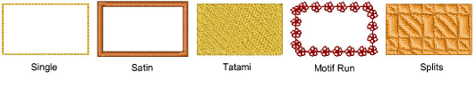
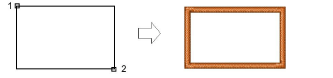
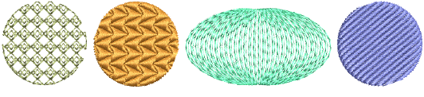
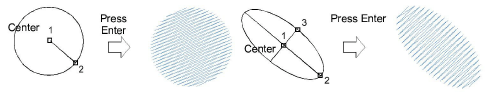

# Digitize regular shapes

|  | Use Graphics Digitizing > Rectangle to digitize rectangle or square objects. Press &lt;Ctrl&gt; for a square. |
| -------------------------------------- | ------------------------------------------------------------------------------------------------------------- |
|      | Use Graphics Digitizing > Ellipse to digitize ellipse or circle objects.                                      |

EmbroideryStudio provides digitizing tools for quickly creating regular shapes such as circles and squares, ovals and rectangles.

## Squares & rectangles

Digitize squares and rectangles with a few clicks of the Rectangle tool. Use any fill or outline stitch type.

Click to mark a corner. Drag the pointer and click to define the opposite corner. To create a square, hold the Ctrl key down whilst dragging the pointer.

## Circles & ovals

Digitize filled circles and ellipses with a few clicks with the Ellipse tool. You can use any stitch type, including outlines. Contour stitch looks most effective with long, narrow ovals.

To digitize circles or ellipses, click to mark the center and click again to set the radius, and press Enter. This point becomes the [entry point](../../glossary/glossary#entry-point). To create an oval, click a third time to mark the second radius point, and press Enter.

## Related topics...

- [Selecting & editing stitches](../../Modifying/functions/Selecting_editing_stitches)
