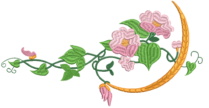

# Digitizing Shapes

In EmbroideryStudio, you build designs from basic shapes or [embroidery objects](../../glossary/glossary). These are like ordinary [vector graphics](../../glossary/glossary) in that they have defining characteristics or ‘[properties](../../glossary/glossary)’ such as color, size, position, and so on. They also have properties unique to embroidery such as stitch type and density. The most important property of an embroidery object is its stitch type. Different stitch types are suited to different shapes.

Tip: EmbroideryStudio also lets you convert [vector objects](../../glossary/glossary) directly to embroidery objects. In fact, entire vector designs can be converted to embroidery. [See also Convert objects with CorelDRAW Graphics.](../../Automatic/automatic/Convert_objects_with_CorelDRAW_Graphics)

## Related topics...

- [Embroidery digitizing](Embroidery_digitizing)
- [Digitizing with graphical tools](Digitizing_with_graphical_tools)
- [Digitizing outlines & details](Digitizing_outlines_details)
- [Digitizing regular columns](Digitizing_regular_columns)
- [Digitizing irregular columns](Digitizing_irregular_columns)
- [Creating free-form shapes](Creating_free-form_shapes)
