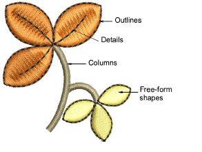

# Digitizing methods

EmbroideryStudio provides an outline/fill digitizing paradigm similar to CorelDRAW® Graphics Suite and other graphics applications. This makes embroidery digitizing easy for those coming from a graphic design background. It also makes it easy to convert between outlines and fills generally. For those coming from an embroidery background, the toolset also provides traditional ‘power digitizing’ methods professional digitizers are familiar with.

## Digitizing toolset

The toolset you will typically use for digitizing work includes some or all of the following:

| Toolbar                | Function                                                                                                                                                                  |
| ---------------------- | ------------------------------------------------------------------------------------------------------------------------------------------------------------------------- |
| Graphics Digitizing    | Select a digitizing method – either graphical or traditional, open or closed.                                                                                             |
| Traditional Digitizing |                                                                                                                                                                           |
| Outlines               | Select a stitch type – either outline or fill. Both open and closed shapes may be treated as outlines. Only closed shapes can be used in conjunction with fill stitching. |
| Fills                  |                                                                                                                                                                           |
| Stitch Effects         | Select a stitch effect to apply as you digitize – e.g. smart corners. These can be modified at any time.                                                                  |
| Color                  | Select a thread color to apply as you digitize. Colors in the palette may or may not be assigned to actual threads. It makes no difference when you digitize.             |

## Graphics digitizing

The graphics approach to digitizing is similar to CorelDRAW® Graphics Suite or other graphics applications. It provides one set of tools to create shapes which can be stitched as outlines or fills. You assign a stitch type to a shape by selecting from the Stitch Types toolbars.

## Traditional digitizing

Traditional digitizing methods divide into three main categories – ‘free shapes’, ‘column shapes’, and ‘outlines’.

EmbroideryStudio also provides special time-saving input tools for creating stars and rings. [See Digitize stars & rings for details.](../../Modifying/productivity/Digitize_stars_rings)

::: tip
Traditional methods also include ‘manual’ digitizing tools. Use these to add individual stitches, either singly or three stitch layers at a time. [See Digitizing manual stitches for details.](../../Modifying/functions/Digitizing_manual_stitches)
:::

## Digitizing methods

Different digitizing tools are suited to different shapes or design elements. Whichever approach you take – graphical or traditional – methods divide broadly into two categories – open or closed – and two types – outline or fill. No stitch type, effect, or thread color is set in stone. Object properties can be modified at any time.

Whenever you select a traditional digitizing tool, instructions in the Prompt Bar guide you through the process. Because these tools use an embroidery digitizing paradigm, you may be prompted to add multiple boundaries for holes, stitch angles, and/or start and end points. Refer to the prompts until the tool becomes familiar to you.

## Underlays

Embroidery appearance and quality depends a lot on [underlay](../../glossary/glossary#underlay) which serves as a foundation for cover stitching. Underlay settings are stored with each object in the same way as other [object properties](../../glossary/glossary#object-properties). They are regenerated whenever the object is [scaled](../../glossary/glossary) or transformed. When Auto Fabric is turned on, a default underlay is applied, based on fabric settings. When Auto Fabric is turned off, an underlay is still applied but it is based on the digitizing method.

## Tips for use...

- Change settings of most tools by right-clicking and adjusting values in the Object Properties docker.
- Use the Prompt Bar to help you digitize.
- If you make a mistake, press Backspace to delete the last point.
- Press Esc to undo all new points. Press Esc again to exit digitizing mode.
- Use Auto Scroll to scroll automatically within the design window while digitizing.
- Hold down the Shift key to temporarily deactivate Auto Scroll.
- Use the Ctrl+Shift+A key combination to quickly toggle Auto Scroll on/off.

::: tip
The Show Repeats function displays repeating designs, including sequins, in both TrueView and stitch view. You can view an existing design, even while digitizing, with any number of repeats.
:::

## Switching between fill & outline

You can switch between a fill stitch input method and Digitize Run or Manual by means of shortcut keys.

- Press Enter to switch between a fill stitch digitizing method and Manual.
- Press Spacebar to switch between a fill stitch digitizing method and Digitize Run.

::: tip
After digitizing, most object types can be easily inter-converted.
:::

## Related topics...

- [Scroll options](../../Setup/settings/Scroll_options)
- [Viewing design repeats](../../Basics/view/Viewing_design_repeats)
- [Creating free-form shapes](Creating_free-form_shapes)
- [Digitizing regular columns](Digitizing_regular_columns)
- [Simple outlines](../stitches/Simple_outlines)
- [Stabilizing with automatic underlay](../../Quality/underlays/Stabilizing_with_automatic_underlay)
- [Digitize stars & rings](../../Modifying/productivity/Digitize_stars_rings)
- [Freehand embroidery](../../Decorative/specialty/Freehand_embroidery)
- [Digitizing manual stitches](../../Modifying/functions/Digitizing_manual_stitches)
- Keyboard shortcuts
