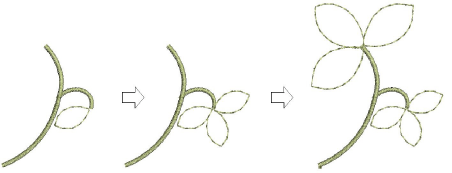
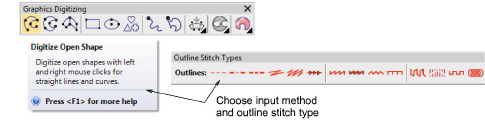
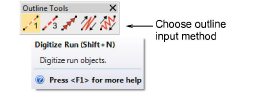
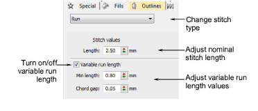
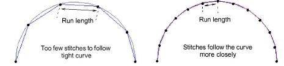

# Digitizing outlines & details

|              | Use Outline > Digitize Run to place a row of single or triple run stitches along a digitized line. |
| -------------------------------------- | -------------------------------------------------------------------------------------------------- |
|  |                                                                                                    |

EmbroideryStudio provides tools for creating outline stitching of varying thickness and styles. These tools place a row of stitching along a digitized line. They are typically used for adding outlines and details. They can also be used for decorative effect.

## To digitize outlines and details...

- Select a suitable input tool together with an outline stitch type.

- Alternatively, choose a traditional outline input method from the Outline tools.

- In addition to Run and Triple Run, traditional methods include:

|      | Use Motif Run to place a row of motifs along a digitized line.        |
| ---------------------------------------- | --------------------------------------------------------------------- |
|  | Use Backstitch to place a row of backstitches along a digitized line. |
|  | Use Stemstitch to place a row of stemstitches along a digitized line. |

- Choose a color from the Color toolbar. You can change colors at any time.
- Digitize the shape by marking reference points:
- Left-click for corner points.
- Right-click for curve points.
- To constrain the line to 15° increments, hold down Ctrl as you digitize.
- For a perfect circular arc, mark three points with a right-click.
- Where curves connect – either to a straight line or another curve – click to mark the connection point.

::: tip
If you make a mistake, press Backspace to delete the last point. Press Esc to undo all new points. Press Esc again to exit digitizing mode.
:::

- Press Enter to finish.
- To view stitches better, use the View toolbar to turn on or off backdrops.
- Optionally, use Edit > Close Curve... commands to close an object using straight or curved points.
- Optionally, double-click the object to access object properties.

- To set a fixed stitch length, adjust the Length field. For sharp curves, reduce length – e.g. 1.8 mm – so that the stitches follow the line more closely. Alternatively, automatically shorten stitches to follow tight curves with the Variable Run Length option.

::: tip
Use Auto Scroll to scroll automatically within the design window while digitizing. Hold down the Shift key to temporarily deactivate Auto Scroll. Use the Ctrl+Shift+A key combination to quickly toggle Auto Scroll on/off.
:::

## Related topics...

- [Simple outlines](../stitches/Simple_outlines)
- [Choosing threads](../../Basics/threads/Choosing_threads)
- [Other general options](../../Setup/settings/Other_general_options)
- [View graphical components](../../Basics/view/View_graphical_components)
- [Scroll options](../../Setup/settings/Scroll_options)
- [Minimizing connectors](../../Quality/connectors/Minimizing_connectors)
