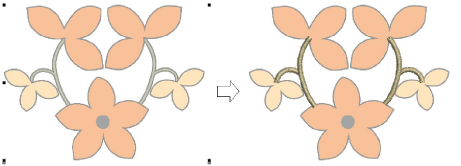

# Digitizing regular columns

Use Column C to digitize columns and borders of fixed width. Column C is usually used with satin stitch but other outline stitch types are available for use. [See also Satin stitching.](../stitches/Satin_stitching)

Tip: You can toggle between Column C and Digitize Run by pressing the Spacebar. [See also Convert objects with CorelDRAW Graphics.](../../Automatic/automatic/Convert_objects_with_CorelDRAW_Graphics)

## Related topics...

- [Create columns & borders](Create_columns_borders)
- [Adjust column width & offset](Adjust_column_width_offset)
- [Set corner fractions](Set_corner_fractions)
- [Set angles & orientation](Set_angles_orientation)
