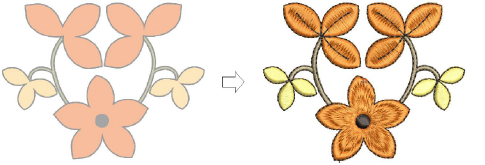

# Embroidery digitizing

The process of creating embroidery objects on screen is called ‘digitizing’. Like design creation in CorelDRAW Graphics, this involves the use of ‘input’ or ‘digitizing’ methods. In fact, digitizing tools in EmbroideryStudio can be used to generate both [embroidery objects](../../glossary/glossary#embroidery-objects) and [vector objects](../../glossary/glossary).

::: tip
The CorelDRAW® Graphics Suite of curve-line digitizing tools such as B-Spline Curve, Freehand, Bézier, Pen, etc, are very useful. Objects created with these tools can be converted directly to embroidery. [See also Convert objects with CorelDRAW Graphics.](../../Automatic/automatic/Convert_objects_with_CorelDRAW_Graphics)
:::

## Related topics...

- [Digitizing methods](Digitizing_methods)
- [Reference points & reshape nodes](Reference_points_reshape_nodes)
- [Join methods](Join_methods)
- [Generate stitches](Generate_stitches)
