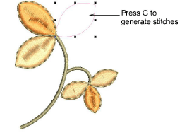

# Generate stitches

|  | Use Stitch > Generate Stitches to generate stitches for selected objects. |
| ---------------------------------------------------- | ------------------------------------------------------------------------- |

With Generate Stitches on (the default), stitches are calculated for new objects whenever you press Enter. They are also updated whenever you [scale](../../glossary/glossary), transform or move the object. If speed is an issue, you can digitize objects with Generate Stitches off.

## To generate stitches...

- To generate stitches for new or selected objects, select Stitch > Generate Stitches or press G.

- To remove stitches, or digitize without generating stitches, deselect Stitch > Generate Stitches or press G again.

::: tip
Make sure Show Outlines is selected, otherwise stitchless objects will not be visible.
:::

## Related topics...

- [Reshape options](../../Setup/settings/Reshape_options)
- [Change backgrounds](../../Basics/view/Change_backgrounds)
