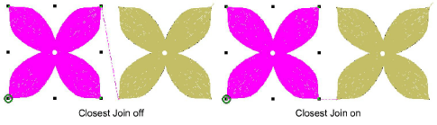

# Join methods

When you are digitizing closed objects, the Closest Join method automatically calculates connector points. When deactivated, all newly digitized objects are joined by the As Digitized method. This means that you manually specify [entry ](../../glossary/glossary)and [exit](../../glossary/glossary#exit) points while digitizing.

::: tip
The Apply Closest Join feature allows you to (re-)apply closest join to objects after editing.
:::

## Related topics...

- [Other general options](../../Setup/settings/Other_general_options)
- [Apply closest join](../../Quality/connectors/Apply_closest_join)
