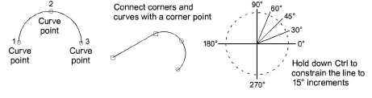

# Reference points & reshape nodes

Once you have selected a digitizing method, you create shapes by marking points along an outline.

Use the left mouse button for corner points and right mouse button for curve points. Bézier control handles are available when you come to modify a shape.

A few general rules apply:

- To constrain the line to 15° increments, hold down Ctrl as you digitize.
- For a perfect circular arc, mark three points with a right-click, and press Enter.

The reference points you mark when digitizing a shape become its ‘[control points](../../glossary/glossary)’. These vary slightly with the object type. Most points can be added, deleted, or moved. Corner and curve points can be interchanged. Some control points such as [entry ](../../glossary/glossary)and [exit](../../glossary/glossary) points cannot be deleted.

## Related topics...

- [Reshaping Objects](../../Modifying/reshape/Reshaping_Objects)
- [Reshaping embroidery objects](../../Modifying/reshape/Reshaping_embroidery_objects)
