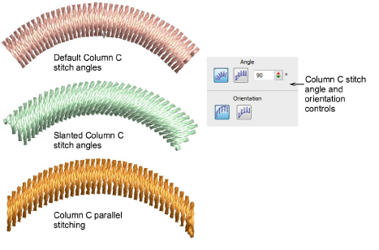
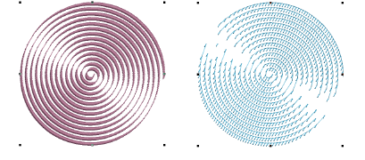
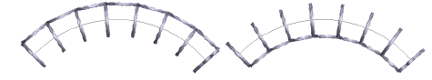

# Set angles & orientation

|  | Use Traditional Digitizing > Column C to digitize columns or borders of fixed width. Right-click for settings. |
| ------------------------------------------ | -------------------------------------------------------------------------------------------------------------- |

The Column C tool provides control of stitching angle and orientation.

Angle and Orientation controls allow you to:

- Control the angle of stitches relative to baseline.
- Create parallel stitching and control the angle relative to the horizontal. Use it to create calligraphy-like stitching in conjunction with Freehand.

- Control orientation to set which side to start stitching on. This is most useful for E Stitch.

## Related topics...

- [Freehand embroidery](../../Decorative/specialty/Freehand_embroidery)
- [Reshape Column C objects](../../Modifying/reshape/Reshape_Column_C_objects)
