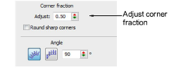
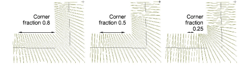

# Set corner fractions

|  | Use Traditional Digitizing > Column C to digitize columns or borders of fixed width. Right-click for settings. |
| ------------------------------------------ | -------------------------------------------------------------------------------------------------------------- |

With sharp curves, spacing which provides adequate coverage on the outside edge may cause bunching along the inside edge. This may cause thread breakage when stitching out. You can control the way stitches turn in [Column C](../../glossary/glossary) objects by adjusting the ‘corner fraction’.

## To set corner fractions...

- [Double-click a Column C object or right-click the tool to access object properties.](../../glossary/glossary)

- Enter a new corner fraction in the Corner Fraction field.
- Increasing the fraction spreads the turn over more stitches.
- Decreasing the fraction reduces the number of stitches that turn.

Tip: Round Sharp Corners is also available for Column C objects to give you the option of sharp or round points.

## Related topics...

- [Round sharp corners](../../Quality/quality/Round_sharp_corners)
