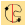
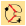
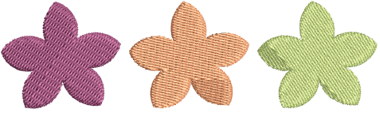
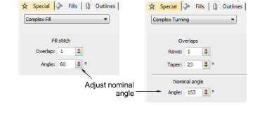
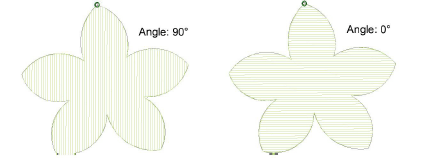

# Set nominal angles

|  | Use Traditional Digitizing > Complex Fill to digitize filled shapes with a single stitch angle. Right-click for settings.    |
| ---------------------------------------------------- | ---------------------------------------------------------------------------------------------------------------------------- |
|    | Use Traditional Digitizing > Complex Turning to digitize filled shapes with turning stitch angles. Right-click for settings. |

[You can change the stitch angle of Complex Fill objects using ](../../glossary/glossary)[object properties. By definition, ](../../glossary/glossary)Complex Turning objects contain multiple stitch angles. However, they also have a property called the ‘nominal angle’.

## To set the nominal angle...

- Double-click a free-shape object to access object properties.

- In the Angle or Nominal Angle field, enter a stitch angle.

::: info Note
The ‘nominal angle’ in a Complex Turning object only takes effect if multiple stitch angles are irreconcilable – it then reverts to parallel stitching in the direction of the nominal angle. The nominal angle also affects certain underlay styles.
:::

::: tip
You can adjust stitch angles of free-form objects interactively using the Stitch Angles tool.
:::

## Related topics...

- [Stabilizing with automatic underlay](../../Quality/underlays/Stabilizing_with_automatic_underlay)
- [Adjusting stitch angles](../../Quality/quality/Adjusting_stitch_angles)
