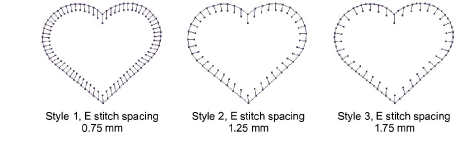
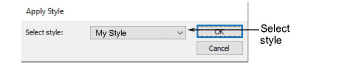

# Apply styles

|  | Use Styles > Apply Style to apply a style from the template to new or selected objects. |
| ---------------------------------------- | --------------------------------------------------------------------------------------- |
|          | Use Styles > Favorite Styles to apply preferred styles to new or selected objects.      |

When you apply a [style](../../glossary/glossary), the settings overwrite [current settings](../../glossary/glossary#current-settings). Any properties not specified in the style, retain their current settings.

## To apply styles...

- If available, click the Favorite Style icon assigned to the style you want to use.
- If an object is selected, the style settings are applied to it alone.
- If no object is selected, the style settings become current and apply to any new objects you create.

- Alternatively, click the Apply Style icon.

- Select a style from the droplist and click OK.

::: tip
If you are using a digitizing tablet, you can quickly switch between preset styles. Each button on the puck accesses the next preset style with different spacing settings. For example, clicking Button 1 accesses &lt;PRESET_SATIN_1&gt;.
:::

## Related topics...

- [Working with object properties](Working_with_object_properties)
- [Assign favorites](Assign_favorites)
