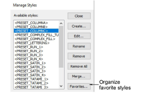
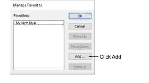
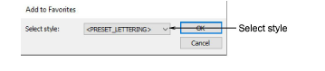

# Assign favorites

You can assign up to ten favorite [styles](../../glossary/glossary) to tool icons on the Styles toolbar. To apply the style, you then simply select the tool.

## To assign a favorite style...

1. Select Setup > Manage Styles.

2. Click Favorites. The Manage Favorites dialog opens.

3. Click Add. The Add To Favorites dialog opens.

4. Select a style from the droplist and click OK.

5. Change the order in which the favorites will appear on the Styles toolbar using Move Up and Move Down.

6. Close out the dialogs. Styles are assigned in the order they appear in the Manage Favorites dialog. The tool tip for each button shows the style name.
