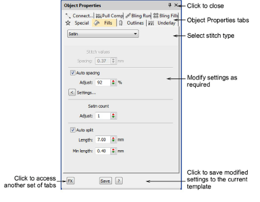
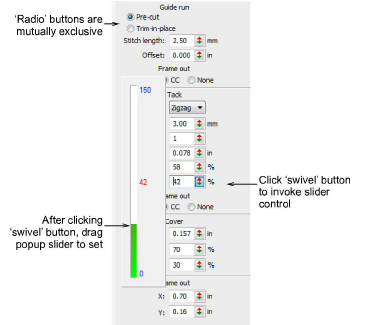

# Change current settings

|  | Use Docker > Object Properties to preset properties or adjust properties of selected objects. |
| ---------------------------------------------------- | --------------------------------------------------------------------------------------------- |

Whenever you change [current settings](../../glossary/glossary#current-settings), these automatically apply to any new objects you create. If you know which settings you require before digitizing, you can preset them.

## To change current settings...

- With no objects selected, click the Object Properties icon.

- Select a tab to view current settings – e.g. Fills.
- Select an item from the droplist – e.g. Fills > Satin – to access those properties.
- Use droplists, radio buttons and checkboxes to choose options. Key in precise values or use the popup slider.

::: tip
The slider has two operating modes – Normal and Accelerated. Holding down the Ctrl key puts it in Accelerated mode.
:::

- Click the FX button to access a further set of tabs and modify settings as required.
- Press Enter to confirm changes. Modified settings are now [current ](../../glossary/glossary)for all new objects. You can apply them to existing objects by means of the Apply Current Properties tool.
- Optionally, click Save. The object properties are saved to the current template. These will apply to any new objects in any design based on this template.
