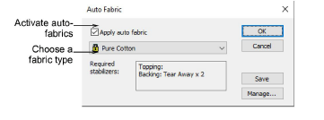
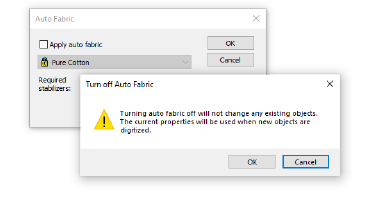
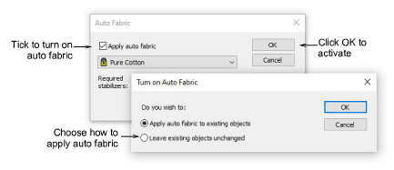

# Change fabrics

Normally you choose a [fabric](../../glossary/glossary) when you start a design although you can change it at any stage. Fabric settings affect all object types other than motif fills, appliqué, and run stitches.

## To change fabrics...

1. Select Design > Auto Fabric.

2. Tick the Apply Auto Fabric checkbox to activate the feature. Conversely, you can turn off auto fabrics at any stage. You are prompted to confirm the decision.

3. From the list, choose a fabric type matching or nearest to the fabric you intend to work with.

4. Click OK.

The selected fabric is displayed in the Status bar. If you choose to apply an auto fabric to a design with no previous fabric, you are prompted to apply it to new objects only or to existing objects as well.

Note: Changing the current Auto Fabric will affect all [colorways ](../../glossary/glossary)in the design. However, the converse is not the case. While colorways allow you to select different fabric swatches for different colorways, these have no bearing on Auto Fabric settings. However, the background Fabric option is ‘aware’ of Auto Fabric selection. Consequently, the Browse button takes you to an assortment of swatches relevant to your current fabric selection.

## Related topics...

- [Create designs from templates](../../Basics/basics/Create_designs_from_templates)
- [Compensating for fabric stretch](../../Quality/underlays/Compensating_for_fabric_stretch)
