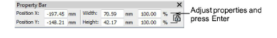
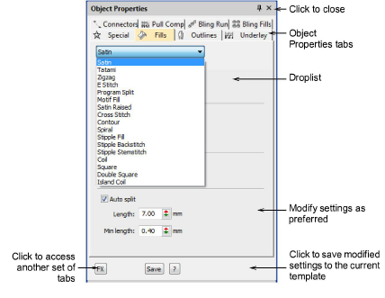

# Change object properties

|  | Use Docker > Object Properties to preset properties or adjust properties of selected objects. |
| -------------------------------------------------------------- | --------------------------------------------------------------------------------------------- |

You can change an object’s properties at any time without affecting those of any other object not currently selected. Some properties can be modified on screen – for example, you can change size by [scaling](../../glossary/glossary#scaling) an object with [selection handles](../../glossary/glossary#selection-handles). Other properties, such as stitch spacing or length, are modified via the Object Properties docker.

## To change object properties...

- Select the object/s whose properties you want to change.

- Use any of the interactive techniques for scaling, transforming, or reshaping selected object/s.
- Adjust general properties – width, height, position – by means of the Property Bar. Press Enter to confirm or Esc to discard.

- Double-click an object to access object properties.

- Select a tab and to access available properties.

If you select more than one object, the Object Properties docker only displays settings relevant to all. If selected objects have different values for the same setting – e.g. stitch length – the field will be blank. If you enter a new value, it applies to all selected objects.

- Click the FX button to access a further set of tabs.
- Press Enter to apply changes to selected object/s.

- Some properties, such as Auto Underlay, are applied by means of toolbar buttons. When the button is selected, that tool’s settings are [current](../../glossary/glossary).
- Optionally, click Save. The object properties are saved to the current template. These will apply to any new objects in any design based on this template.

## Related topics...

- [Access object properties](../../Basics/basics/Access_object_properties)
- [Transforming Objects](../../Modifying/transform/Transforming_Objects)
- [Working with templates](Working_with_templates)
- [Reshaping Objects](../../Modifying/reshape/Reshaping_Objects)
