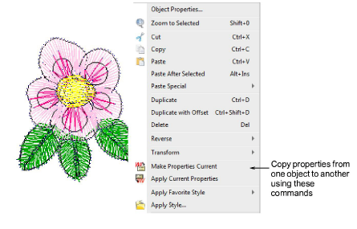
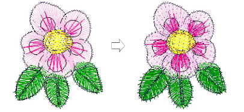

# Copy properties

|    | Click Styles > Make Properties Current to make the properties of a selected object current for the design. |
| ---------------------------------------------------------------- | ---------------------------------------------------------------------------------------------------------- |
|  | Use Styles > Apply Current Properties to apply current settings to selected objects.                       |

You can make a selected object’s ‘actual’ properties ‘[current](../../glossary/glossary)’ for all new objects or apply them to existing objects.

## To copy properties...

- Select the object whose properties you want to make current.
- Click the Make Properties Current icon. Alternatively, right-click the selected object and choose the Make Properties Current command in the popup menu.

- Select the object/s whose properties you want to change.
- Click the Apply Current Properties icon. Alternatively, right-click the selected object and choose the Apply Current Properties command in the popup menu.

