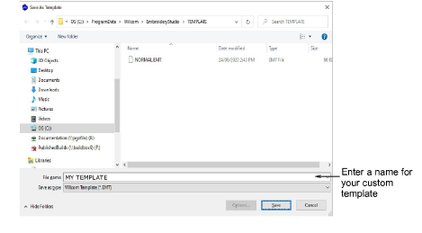

# Create design templates

You create [templates](../../glossary/glossary) from designs containing the required objects and property settings. Simply save the design, or elements of it, as a template. Templates look the same as design files, but use the file extension EMT.

## To create a design template...

1Start a new design or open an existing one.

2Adjust the property settings, styles, and effects as required.

3Add the objects and lettering to be included in the template. For instance, you may want to include sample lettering using different baselines. Simply overtype the sample text when using the template.

4Select File > Save As. The Save as Template dialog opens onto the Template folder.

5Select Design Templates (EMT) from Save as type list.

EmbroideryStudio automatically opens the C:\\Program Files\\Wilcom\\EmbroideryStudio_e4.5\\Template folder. Design templates must be saved here or they will not appear in the template list when you start a new design.

6Enter a name and click Save. The template is ready for use.

Tip: The File menu provides separate commands for saving monogram and team name templates. See related topics below.

## Related topics...

- [Working with baselines](../../Lettering/lettering_create/Working_with_baselines)
- [Monogram designs](../../Lettering/lettering_monograms/Monogram_designs)
