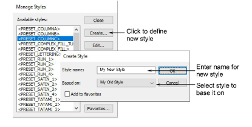

# Define styles

Define new [styles](../../glossary/glossary#styles) for a [design template](../../glossary/glossary#design-template), either from scratch or based on an existing style or object. New styles are saved to the current template.

## To define a style...

1. To base the new style on an existing object, select it now. To base it on current settings, make sure no objects are selected.

2. Select Setup > Manage Styles.

3. Click Create.

4. Enter a new style name. Choose how you want to base your style:

- If you want to base the new style on [default settings](../../glossary/glossary) – current or selected object – select blank.
- If you want to base it on an existing style, select from the droplist.

5. If you want the new style to be added to the Style toolbar, tick the Favorites checkbox.

6. Click OK. The Object Properties docker opens.

7. Update properties as required.

- If you want to apply current settings, click Apply.
- Otherwise, update those settings you want to change. You don’t have to enter values in all fields, only those you specifically wish to store.

8. Press Enter. The new style is saved to the current template.
