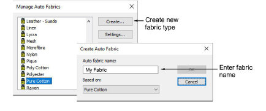
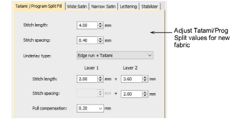
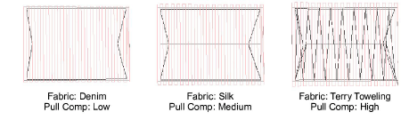
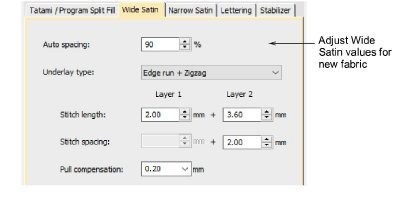
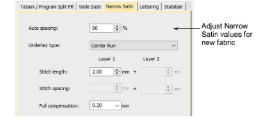
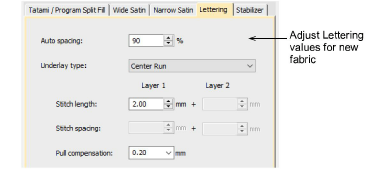
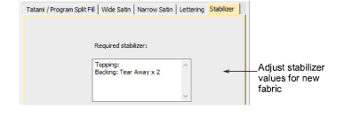

# Manage fabrics

In addition to predefined [fabric](../../glossary/glossary) settings, you can create your own custom fabrics to suit particular needs. You can also modify, rename or delete custom fabrics.

## To create a new fabric...

1Select Setup > Manage Auto Fabrics.

If you already have custom fabrics defined, you have the option of editing, renaming, or deleting.

2To create a new fabric type, click Create.

3Enter a new fabric name. If you want to base the new fabric on [default settings](../../glossary/glossary), select blank.

4Click OK.

The Auto Fabric Settings dialog opens. This dialog allows you to set the fabric values for four object groups – Tatami/Program Split, Wide Satin, Narrow Satin, and Lettering – as well as enter details of any recommended stabilizers.

## To set tatami/program split values...

- Click the tab to access Tatami/Program Split Fill settings. These will become the defaults for Tatami and Program Split objects.

- Adjust Length and Spacing settings for your Tatami / Program Split Fill objects as required:
- Tatami stitch consists of rows of run stitches and is suitable for filling large, irregular shapes. [See Tatami stitching for details.](../stitches/Tatami_stitching)
- Program Split is a decorative stitch type. Use it to fill wide and large areas with artistic effects while keeping the appearance of a solid field of stitching. [See Creating textures with program splits for details.](../../Decorative/patterns/Creating_textures_with_program_splits)
- Set a suitable underlay type for Tatami/Program Split objects. [See Stabilizing with automatic underlay for details.](../../Quality/underlays/Stabilizing_with_automatic_underlay)
- Set a pull compensation allowance for these objects. [See Compensating for fabric stretch for details.](../../Quality/underlays/Compensating_for_fabric_stretch)

## To set satin object values...

- Click the tab to access Wide Satin settings. These settings will become the defaults for larger Satin objects.

- Adjust the Wide Satin settings as you did for Tatami / Program Split objects. [See Satin stitching for details.](../stitches/Satin_stitching)

Instead of Stitch Length and Stitch Spacing settings, you have a single density setting which is controlled by a slider bar.

- Click the tab to access the Narrow Satin settings and adjust as you did for Wide Satin objects. Generally, narrow objects will require a different underlay type. [See Satin stitching for details.](../stitches/Satin_stitching)

## To set lettering object values...

- Click the tab to access Lettering settings.

- Adjust settings as you did for Satin objects. [See Applying stitch types & effects to lettering for details.](../../Lettering/lettering_advanced/Applying_stitch_types_effects_to_lettering)

## To set stabilizer settings...

- Click the tab to access Stabilizer settings.

- Key in one or more recommended stabilizer(s) together with a description or any other relevant information for the custom fabric. This information will be displayed in the Choose Fabric dialog. [See Change fabrics for details.](Change_fabrics)
