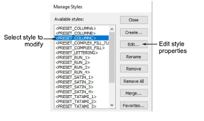

# Modify styles

The Setup > Manage Styles function allows you to modify [styles](../../glossary/glossary#styles), including the factory presets in the NORMAL [template](../../glossary/glossary). You can merge settings from one style to another. You can rename a style without affecting its settings. You can also remove any unwanted styles from a template.

Select a style from the list and modify using the available buttons:

| Function     | Description                                                                                                                                                 |
| ------------ | ----------------------------------------------------------------------------------------------------------------------------------------------------------- |
| Edit         | Edit styles as you would a selected object. [See Change current settings for details.](Change_current_settings)                                             |
| Rename       | Rename a style at any time. Select names that will help you remember the style or help you sort frequently-used styles to the top of the list.              |
| Remove / All | Remove unwanted styles from the current template. The style is removed from the list of style names. To remove all styles from a template click Remove All. |
| Merge        | Copy settings from one style to another via the Merge With Style dialog. When you merge, settings from the second style overwrite the first.                |
| Favorites    | You can assign up to ten favorite styles to tool icons on the Styles toolbar. [See Assign favorites for details.](Assign_favorites)                         |

::: tip
At some stage, you may want to revert to the original style settings in the NORMAL template. [See Revert to the NORMAL template for details.](Revert_to_the_NORMAL_template)
:::
