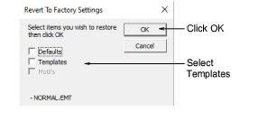

# Revert to the NORMAL template

If you modify the NORMAL [template](../../glossary/glossary) supplied with EmbroideryStudio, you can revert to the original version. A factory copy is always maintained so that the NORMAL template can be restored.

## To revert to the NORMAL template...

1Close EmbroideryStudio.

2Click the MS Windows® Start button and navigate to the Wilcom EmbroideryStudio group.

3Select Revert. The Revert to Factory Settings dialog opens.

4Select the Templates checkbox and click OK. The original settings for the NORMAL template are restored.
