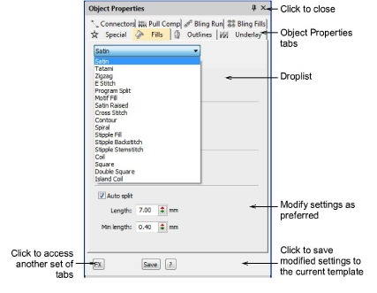

# Save current properties to a template

|  | Use Docker > Object Properties to preset properties or adjust properties of selected objects. |
| -------------------------------------------------------------- | --------------------------------------------------------------------------------------------- |

You can easily save [current settings](../../glossary/glossary#current-settings) to the current [template](../../glossary/glossary).

## To save current properties to a template...

- To use the current property settings, deselect all objects, then click the Object Properties icon.
- To use the settings of a favorite style, click the button with no objects selected.
- Open the Object Properties docker.

- Make any further adjustments as required.
- Click Save. Current settings are saved to the template as the new defaults.

::: tip
To save more than one set of property settings to the template, save them as styles.
:::

## Related topics...

- [Working with object properties](Working_with_object_properties)
- [Define styles](Define_styles)
