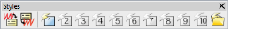

# Working with styles

A style is a group of property settings stored under a unique name. This makes it easy to apply them to selected embroidery and lettering objects. Use the Styles toolbar to apply styles to selected objects. The tools also allow you to set and apply [current settings](../../glossary/glossary#current-settings). Styles you tag as ‘favorites’ are each assigned an icon on the toolbar.

Styles are stored with the design [template](../../glossary/glossary). The NORMAL template provides a selection of preset styles for you to use. Each template may contain specific styles for different types of embroidery. [See also Working with templates.](Working_with_templates)

## Related topics...

- [Apply styles](Apply_styles)
- [Define styles](Define_styles)
- [Modify styles](Modify_styles)
- [Assign favorites](Assign_favorites)
