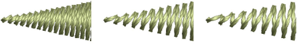
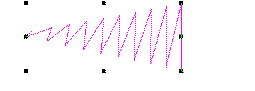
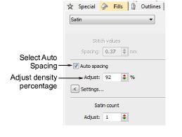
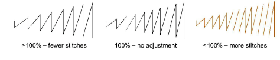

# Applying satin stitch

|                    | Use Fill Stitch Types > Satin to apply satin stitch to new or selected narrow columns and shapes. Right-click for settings.                                        |
| -------------------------------------------------------- | ------------------------------------------------------------------------------------------------------------------------------------------------------------------ |
|              | Use Outline Stitch Types > Satin to create thicker borders or columns of even thickness. Right-click for settings.                                                 |
|        | Use Fill Stitch Types > Satin Raised to create raised surfaces – can be applied to lettering or used with trapunto for quilting effects. Right-click for settings. |
|  | Use Outline Stitch Types > Satin Raised to create raised satin borders – can be used with outlines for quilting effects. Right-click for settings.                 |

In EmbroideryStudio, the Auto Spacing option is turned on by default. For most purposes, this option avoids thread breaks and creates visually appealing columns of satin stitches.

If a column is too wide, stitches may be loose and not cover the fabric properly. Conversely, in very narrow columns, stitch density may be too high and needle penetrations damage the fabric. Adjust stitch density by setting a fixed spacing, or let Auto Spacing calculate spacings wherever column width changes.

## To apply satin stitch with auto-spacing...

1. Select the digitizing method you want to use – e.g. [Column C](../../glossary/glossary).

2. Select Satin and create an [embroidery object](../../glossary/glossary). Alternatively, select an existing embroidery object and click Satin.

3. Right-click the Satin icon to access object properties.

4. Tick Auto Spacing if not already checked.

5. Adjust Stitch Density for more or less open fills.

Density is given as a percentage of preset values:

- To decrease, increase the percentage – e.g. to 110-115%.
- To increase, decrease the percentage – e.g. to 90-85%.

7. 5% generally produces high quality embroidery. An increased stitch count means the design will take longer and be more expensive to stitch.

8. Press Enter or click Apply.

Note: For even more precise results, you can adjust Auto Spacing settings.

## Related topics...

- [Embroidery digitizing](../input/Embroidery_digitizing)
- [Satin auto-spacing](Satin_auto-spacing)
