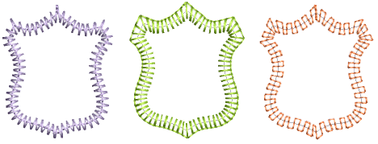

# Border stitching

|    | Click Outline Stitch Types > Zigzag to create open borders or columns of even width for an open ‘sawtooth’ effect. Right-click for settings. |
| ------------------------------------------------ | -------------------------------------------------------------------------------------------------------------------------------------------- |
|  | Use Outline Stitch Types > E Stitch to create open borders or columns of even width for an open ‘comb’ effect. Right-click for settings.     |
|                  | Use Outline Stitch Types > Square to create open borders or columns of even width for an open ‘toothed’ effect. Right-click for settings.    |

The Stitch Types toolbars include Zigzag, E Stitch, and Square. All can be used to create borders around [appliqués](../../glossary/glossary) and other embroidery objects. They can also be used for decorative effects or open fills where fewer stitches are required. Zigzag and double zigzag stitches are also frequently used as underlays. [See also Decorative borders.](../../Decorative/specialty/Decorative_borders)

