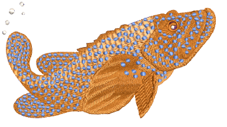

# Curved stitching

EmbroideryStudio provides a variety of stitch types and techniques for creating curved stitching effects. These follow the contours of a shape and can be used to give a sense of depth and movement to your stitching. Some can be used with borders as well as fills. [See also Curved Stitching.](../../Decorative/curves/Curved_Stitching)

Curved stitch effects covered in the related topics below include:

| Feature                                              | Overview            |                                                                                                                    |
| ---------------------------------------------------- | ------------------- | ------------------------------------------------------------------------------------------------------------------ |
|            | Contour             | Stitches follow the contours of a shape, creating a contoured, light and shade effect.                             |
|                      | Offset              | Similar to Contour in following the contours of a shape. It can be used in combination with turning stitches.      |
|              | Spiral Fill         | Works best with simple shapes without holes or islands. Use it with either fixed or variable length run stitching. |
|              | Radial Fill         | Generates radial turning stitching in several stitch types such as Satin, Tatami and Program Split.                |
|              | Flexi Split         | Decorative effect where one or more lines of a program split pattern are molded to the object shape.               |
|  | Florentine / Liquid | Create interesting curved effects by getting needle penetrations to follow the contour of digitized lines.         |

## Related topics...

- [Contoured fills](../../Decorative/curves/Contoured_fills)
- [Offset fills](../../Decorative/curves/Offset_fills)
- [Spiral fills](../../Decorative/curves/Spiral_fills)
- [Radial fills](../../Decorative/curves/Radial_fills)
- [Flexi-splits](../../Decorative/curves/Flexi-splits)
- [Curved fills](../../Decorative/curves/Curved_fills)
